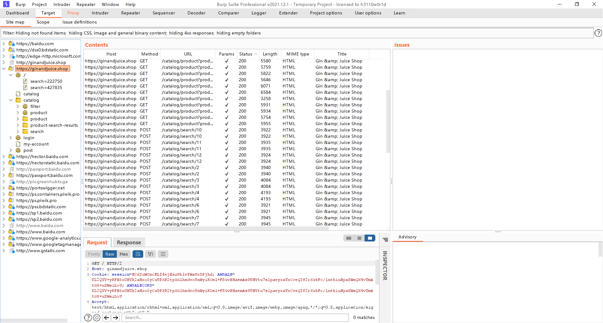
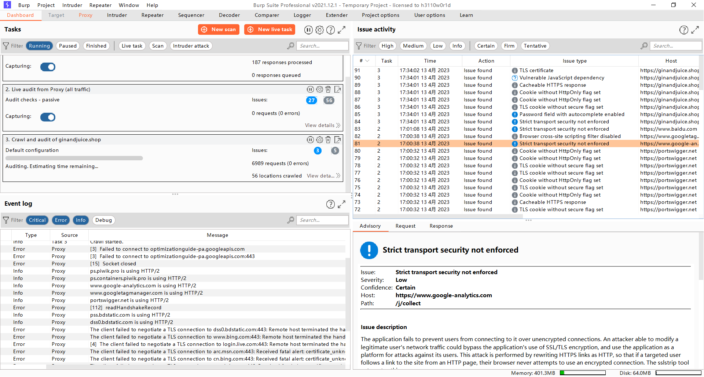

#### [1，使用 Burp 代理拦截 HTTP 流量。](https://portswigger.net/burp/documentation/desktop/getting-started/intercepting-http-traffic)

#### [2，在 Burp 代理中修改请求。](https://portswigger.net/burp/documentation/desktop/getting-started/modifying-http-requests)

#### [3，在 Burp 代理中修改请求。](https://portswigger.net/burp/documentation/desktop/getting-started/modifying-http-requests)

#### [4，设置目标范围。](https://portswigger.net/burp/documentation/desktop/getting-started/setting-target-scope)

#### [5，使用打嗝中继器手动重新发出请求。](https://portswigger.net/burp/documentation/desktop/getting-started/reissuing-http-requests)

#### [6，爬网扫描。](https://portswigger.net/burp/documentation/desktop/getting-started/running-your-first-scan)

##### 爬网将完成，Burp 扫描程序将开始审核漏洞。当它发现问题时，这些问题将显示在 **Issue activity** panel on the **Dashboard** tab.

#### 

#### 6，生成报告。](https://portswigger.net/burp/documentation/desktop/getting-started/generate-reports)